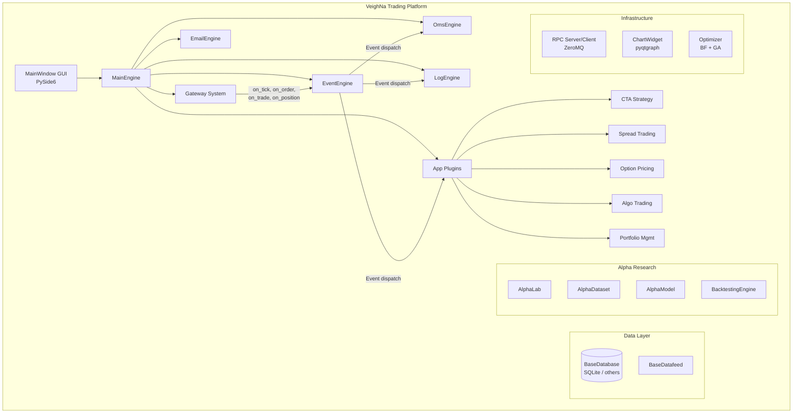

# VeighNa (vnpy) Documentation

> **Last Updated**: 2026-04-06T16:25:30Z  \
> **Git Hash**: `ecae5699`

> **Version**: 4.3.0 | **License**: MIT | **Python**: 3.13+ | **Author**: Xiaoyou Chen

## Overview

VeighNa (formerly vnpy) is a full-featured, open-source quantitative trading platform built in Python. Originally developed as a Chinese-origin project, it has grown into one of the most widely adopted retail and institutional quant frameworks in the Chinese markets, with expanding global exchange support.

The platform provides a complete trading lifecycle -- from strategy research and backtesting through live execution and risk monitoring -- all driven by a core event engine architecture.

## Key Features

- **Event-Driven Architecture** -- A thread-based `EventEngine` at the core handles all message dispatch between components, ensuring loose coupling and extensibility.
- **Multi-Exchange Gateway System** -- Abstract `BaseGateway` class with plug-in adapters for Chinese futures/equities (CTP, CFFEX, SHFE, SSE, SZSE) and global venues (Interactive Brokers, CME, NYSE, NASDAQ, SGX, SEHK, and more).
- **Application Plugin System** -- Modular `BaseApp` architecture for CTA strategy, spread trading, option pricing, portfolio management, algorithmic execution, and more.
- **Alpha Research Lab** -- Integrated `AlphaLab` with dataset management, ML model training (LightGBM, MLP, Lasso), factor analysis via Alphalens, and portfolio backtesting with Polars DataFrames.
- **Order Management System (OMS)** -- Built-in `OmsEngine` tracking ticks, orders, trades, positions, accounts, and contracts with automatic offset conversion for SHFE/INE exchanges.
- **Database & Datafeed Abstraction** -- Pluggable `BaseDatabase` and `BaseDatafeed` interfaces with dynamic module loading (SQLite default, extensible to other backends via `vnpy_*` packages).
- **Desktop GUI** -- PySide6-based `MainWindow` with dock panels for trading, market data, orders, positions, accounts, and logs.
- **RPC Framework** -- ZeroMQ-based `RpcServer`/`RpcClient` for distributed deployment with heartbeat monitoring.
- **K-Line Charting** -- Interactive `ChartWidget` built on pyqtgraph for candlestick visualization.
- **Strategy Optimization** -- Brute-force and genetic algorithm (DEAP) parameter optimization with multiprocessing.
- **Internationalization** -- Locale system with Babel-based i18n (Chinese/English).

## Quick Start

VeighNa's live trading gateways require exchange credentials (e.g., CTP for Chinese futures). The example below demonstrates the **EventEngine** and **data objects** without any external API keys:

```python
"""VeighNa Quick Start -- EventEngine demo with simulated tick data."""
from datetime import datetime
from vnpy.event import EventEngine, Event
from vnpy.trader.event import EVENT_TICK
from vnpy.trader.object import TickData
from vnpy.trader.constant import Exchange

# 1. Create and start the event engine
event_engine = EventEngine()

def on_tick(event: Event) -> None:
    tick: TickData = event.data
    print(f"[{tick.datetime}] {tick.symbol}.{tick.exchange.value} "
          f"last={tick.last_price} vol={tick.volume}")

event_engine.register(EVENT_TICK, on_tick)
event_engine.start()

# 2. Simulate a market tick
tick = TickData(
    symbol="IF2401",
    exchange=Exchange.CFFEX,
    datetime=datetime.now(),
    gateway_name="SIMULATED",
    last_price=3850.2,
    volume=12345,
)
event_engine.put(Event(EVENT_TICK, tick))

import time; time.sleep(0.5)  # allow async dispatch
event_engine.stop()
# Output: [2024-...] IF2401.CFFEX last=3850.2 vol=12345
```

For full backtesting with the Alpha module, see the [Alpha Strategy Development](development.md#alpha-strategy-development) section.

## External Package Matrix

VeighNa's gateway and application modules are distributed as separate `vnpy_*` packages. Install only what you need:

| Package | Type | Description |
|---------|------|-------------|
| `vnpy_ctp` | Gateway | CTP futures (China Financial Futures Exchange, commodity exchanges) |
| `vnpy_ctptest` | Gateway | CTP test/simulation environment |
| `vnpy_mini` | Gateway | CTP Mini (lower latency CTP alternative) |
| `vnpy_sopt` | Gateway | CTP stock options (SSE/SZSE options) |
| `vnpy_ib` | Gateway | Interactive Brokers (global equities, futures, options, forex) |
| `vnpy_femas` | Gateway | FEMAS futures gateway |
| `vnpy_xtp` | Gateway | XTP (Zhongtai Securities, equities/options) |
| `vnpy_tora` | Gateway | TORA (Huaxin Securities) |
| `vnpy_oes` | Gateway | OES (Baoshang Securities) |
| `vnpy_tap` | Gateway | TAP (Yisheng Information) global futures |
| `vnpy_da` | Gateway | Direct Access (Zhisheng) global futures |
| `vnpy_rohon` | Gateway | Rohon (risk management gateway) |
| `vnpy_ctastrategy` | App | CTA strategy engine (single-instrument trend/mean-reversion) |
| `vnpy_ctabacktester` | App | CTA strategy backtesting with GUI |
| `vnpy_spreadtrading` | App | Spread trading between correlated instruments |
| `vnpy_optionmaster` | App | Option pricing, Greeks, and volatility surface |
| `vnpy_portfoliostrategy` | App | Multi-instrument portfolio strategies |
| `vnpy_algotrading` | App | Algorithmic order execution (TWAP, VWAP, Iceberg, etc.) |
| `vnpy_scripttrader` | App | Jupyter-style scripted trading interface |
| `vnpy_chartwizard` | App | Advanced K-line charting with indicators |
| `vnpy_rpcservice` | App | RPC service for distributed deployment |
| `vnpy_datamanager` | App | Historical data import/export/management |
| `vnpy_datarecorder` | App | Real-time tick and bar data recording |
| `vnpy_riskmanager` | App | Real-time risk monitoring and position limits |
| `vnpy_webtrader` | App | Web-based trading interface |
| `vnpy_portfoliomanager` | App | Portfolio tracking and P&L monitoring |
| `vnpy_sqlite` | Database | SQLite database backend (default) |
| `vnpy_mysql` | Database | MySQL database backend |
| `vnpy_postgresql` | Database | PostgreSQL database backend |
| `vnpy_mongodb` | Database | MongoDB database backend |
| `vnpy_influxdb` | Database | InfluxDB database backend |
| `vnpy_rqdata` | Datafeed | RQData (Ricequant) market data feed |
| `vnpy_tushare` | Datafeed | TuShare market data feed |
| `vnpy_wind` | Datafeed | Wind Financial Terminal data feed |
| `vnpy_ifind` | Datafeed | iFinD (THS) data feed |
| `vnpy_tinysoft` | Datafeed | TinySoft data feed |

Install example: `pip install vnpy_ctp vnpy_ctastrategy`

## Official Links

| Resource | URL |
|----------|-----|
| Homepage | [vnpy.com](https://www.vnpy.com) |
| Documentation | [vnpy.com/docs](https://www.vnpy.com/docs) |
| GitHub | [github.com/vnpy/vnpy](https://github.com/vnpy/vnpy/) |
| Forum | [vnpy.com/forum](https://www.vnpy.com/forum) |
| Changelog | [CHANGELOG.md](https://github.com/vnpy/vnpy/blob/master/CHANGELOG.md) |

## Architecture Overview



## Component Summary

| Component | Location | Description |
|-----------|----------|-------------|
| EventEngine | [`src/vnpy/event/engine.py`](../src/vnpy/event/engine.py) | Core event-driven message bus with timer support |
| MainEngine | [`src/vnpy/trader/engine.py`](../src/vnpy/trader/engine.py) | Central orchestrator managing gateways, engines, and apps |
| OmsEngine | [`src/vnpy/trader/engine.py`](../src/vnpy/trader/engine.py) | Order management system tracking all trading state |
| BaseGateway | [`src/vnpy/trader/gateway.py`](../src/vnpy/trader/gateway.py) | Abstract gateway interface for exchange connections |
| BaseApp | [`src/vnpy/trader/app.py`](../src/vnpy/trader/app.py) | Abstract application plugin interface |
| Data Objects | [`src/vnpy/trader/object.py`](../src/vnpy/trader/object.py) | Dataclass definitions: TickData, BarData, OrderData, TradeData, etc. |
| Constants | [`src/vnpy/trader/constant.py`](../src/vnpy/trader/constant.py) | Enums: Direction, Status, Exchange, Product, OrderType, Interval |
| BaseDatabase | [`src/vnpy/trader/database.py`](../src/vnpy/trader/database.py) | Abstract database interface for bar/tick persistence |
| BaseDatafeed | [`src/vnpy/trader/datafeed.py`](../src/vnpy/trader/datafeed.py) | Abstract market data feed interface |
| OffsetConverter | [`src/vnpy/trader/converter.py`](../src/vnpy/trader/converter.py) | Position offset conversion for SHFE/INE exchanges |
| Optimizer | [`src/vnpy/trader/optimize.py`](../src/vnpy/trader/optimize.py) | Brute-force and genetic algorithm optimization |
| MainWindow | [`src/vnpy/trader/ui/mainwindow.py`](../src/vnpy/trader/ui/mainwindow.py) | Desktop trading GUI |
| RPC | [`src/vnpy/rpc/`](../src/vnpy/rpc/) | ZeroMQ-based RPC server/client |
| Chart | [`src/vnpy/chart/`](../src/vnpy/chart/) | Interactive K-line charting widget |
| AlphaLab | [`src/vnpy/alpha/lab.py`](../src/vnpy/alpha/lab.py) | Alpha research laboratory |
| AlphaDataset | [`src/vnpy/alpha/dataset/template.py`](../src/vnpy/alpha/dataset/template.py) | Feature engineering and dataset management |
| AlphaModel | [`src/vnpy/alpha/model/template.py`](../src/vnpy/alpha/model/template.py) | ML model template (LightGBM, MLP, Lasso) |
| AlphaStrategy | [`src/vnpy/alpha/strategy/template.py`](../src/vnpy/alpha/strategy/template.py) | Portfolio strategy template with backtesting |

## Documentation Index

| Document | Description |
|----------|-------------|
| [Architecture](architecture.md) | System architecture, component diagrams, gateway and app plugin systems |
| [Workflows](workflow.md) | Event-driven flows, order lifecycle, strategy execution, backtesting |
| [State Management](state-management.md) | Order state machine, position tracking, gateway and strategy states |
| [Development Guide](development.md) | Setup, project structure, gateway/strategy/app development guides |
