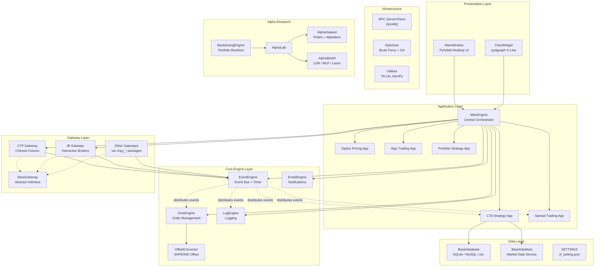
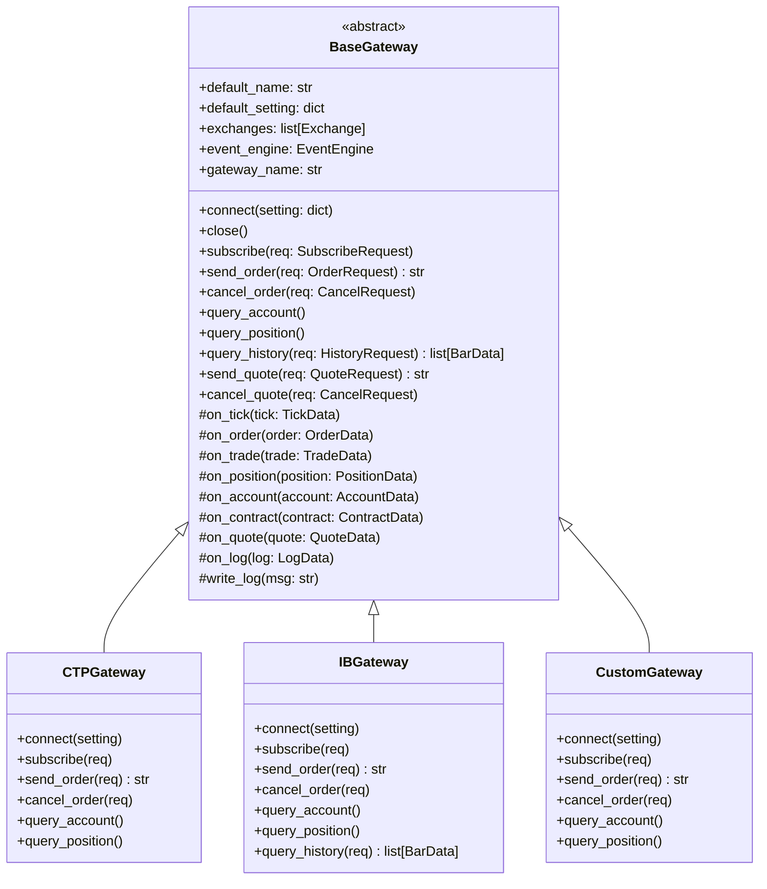
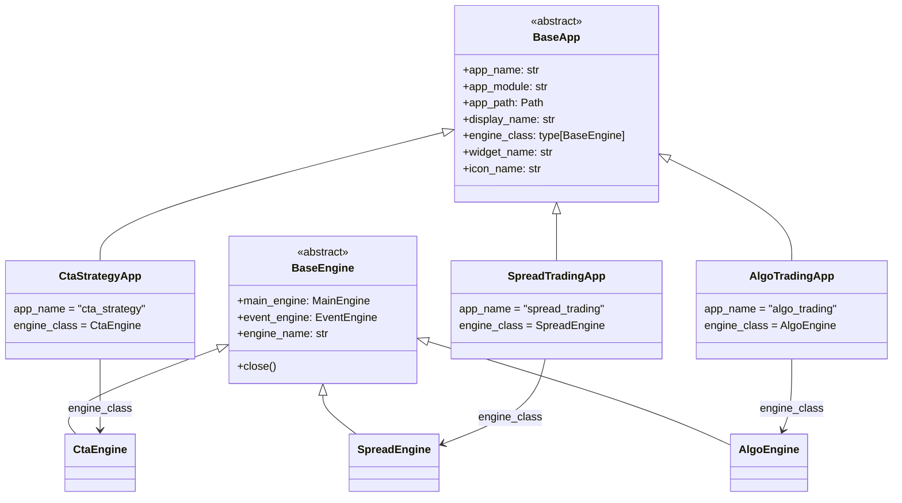

# Architecture

## System Architecture

VeighNa follows a layered, event-driven architecture. The `MainEngine` sits at the center, coordinating between the `EventEngine` message bus, exchange `Gateway` connections, and application plugins. All communication between components flows through typed events.

## Trading Paradigm & Key Features

| Feature | Support | Details |
|---------|---------|---------|
| Backtesting Approach | Event-driven | Bar-by-bar replay with `BacktestingEngine`; portfolio-level multi-asset backtesting via Alpha module |
| Live Trading | Yes | Full live trading through 40+ exchange gateways (CTP, IB, and many more) |
| Paper Trading | Yes | Simulated trading via gateway-level simulation; no separate paper mode toggle |
| Multi-Asset | Yes | Chinese futures (CFFEX, SHFE, CZCE, DCE, INE, GFEX), stocks (SSE, SZSE, BSE), global markets (NYSE, NASDAQ, CME, SEHK, SGX, etc.), options, forex, crypto |
| Data Feeds | Multiple sources | Pluggable `BaseDatafeed` interface; gateway-provided real-time ticks; historical bar data from `vnpy_*` datafeed packages; Parquet files for Alpha research |
| ML Integration | Yes | Built-in Alpha module with LightGBM, MLP (PyTorch), and Lasso models; Alphalens integration for factor analysis |
| Risk Management | Built-in | Risk Manager app for pre-trade checks; `OffsetConverter` for SHFE/INE position offset; position and account monitoring via OmsEngine |
| Optimization | Yes | Brute-force and genetic algorithm (GA) parameter optimization in `optimize.py`; strategy design optimization via Alpha module |
| Execution | Both | Simulated execution in backtesting; live execution via gateways; algorithmic execution (TWAP, VWAP, iceberg, sniper) via Algo Trading app |

## Core Components

### MainEngine

**Location**: [`src/vnpy/trader/engine.py`](../src/vnpy/trader/engine.py)

The `MainEngine` is the central orchestrator of the platform. It:

- Creates and starts the `EventEngine` on initialization
- Maintains registries of gateways (`self.gateways`), engines (`self.engines`), and apps (`self.apps`)
- Initializes built-in engines: `LogEngine`, `OmsEngine`, `EmailEngine`
- Delegates convenience methods from `OmsEngine` (e.g., `get_tick`, `get_order`, `get_all_positions`)
- Routes trading commands (`connect`, `subscribe`, `send_order`, `cancel_order`) to the appropriate gateway
- Manages clean shutdown by stopping the event engine, then closing all engines and gateways

### EventEngine

**Location**: [`src/vnpy/event/engine.py`](../src/vnpy/event/engine.py)

The event-driven core of the platform. It uses a thread-safe queue and two background threads:

- **Event processing thread** (`_run`): Pulls `Event` objects from a `Queue`, dispatches to registered handlers by event type, then to general handlers.
- **Timer thread** (`_run_timer`): Generates `EVENT_TIMER` events at a configurable interval (default 1 second).

Key API:
- `register(type, handler)` -- Register a handler for a specific event type
- `register_general(handler)` -- Register a handler for all event types
- `put(event)` -- Enqueue an event for processing
- `start()` / `stop()` -- Lifecycle management

Event types are string constants defined in [`src/vnpy/trader/event.py`](../src/vnpy/trader/event.py):
- `EVENT_TICK`, `EVENT_ORDER`, `EVENT_TRADE`, `EVENT_POSITION`, `EVENT_ACCOUNT`, `EVENT_CONTRACT`, `EVENT_QUOTE`, `EVENT_LOG`, `EVENT_TIMER`

### OmsEngine (Order Management System)

**Location**: [`src/vnpy/trader/engine.py`](../src/vnpy/trader/engine.py)

Maintains in-memory dictionaries for all trading state:
- `ticks`, `orders`, `trades`, `positions`, `accounts`, `contracts`, `quotes`
- `active_orders` and `active_quotes` (filtered by `ACTIVE_STATUSES`)
- `offset_converters` per gateway for SHFE/INE position offset handling

Registers handlers for all core event types and updates its state automatically when events arrive.

### LogEngine

Listens to `EVENT_LOG` events and routes log messages through Loguru with gateway context.

### EmailEngine

Asynchronous email sending via SMTP (configurable in `SETTINGS`). Starts its worker thread on first use.

## Gateway Architecture

Gateways are the bridge between VeighNa and external trading systems. Each gateway extends `BaseGateway` and must implement the core abstract methods.

**Gateway callback flow**: When a gateway receives data from the exchange, it calls the appropriate `on_*` method (e.g., `on_tick(tick)`), which creates an `Event` and pushes it into the `EventEngine`. The event is then distributed to all registered handlers (OmsEngine, strategy engines, UI widgets, etc.).

**Event routing pattern**: Each `on_*` method pushes two events -- a general event (e.g., `EVENT_TICK`) and a symbol-specific event (e.g., `EVENT_TICK + vt_symbol`). This allows handlers to listen for all ticks or only ticks for a specific instrument.

**Supported exchanges** include 40+ venues across Chinese markets (CFFEX, SHFE, CZCE, DCE, INE, GFEX, SSE, SZSE, BSE, SGE) and global markets (NYSE, NASDAQ, CME, COMEX, GLOBEX, ICE, SEHK, SGX, EUREX, LME, and more).

## App Plugin System

Applications extend the platform with trading functionality. Each app is defined by a class that inherits from `BaseApp`.

**App registration flow**:
1. `MainEngine.add_app(app_class)` instantiates the `BaseApp` subclass
2. The app's `engine_class` is instantiated via `add_engine()`, receiving `MainEngine` and `EventEngine`
3. The engine registers its event handlers with the `EventEngine`
4. The UI discovers apps through `main_engine.get_all_apps()` and dynamically imports their `ui` module to create menu entries

**Available app types** (installed as separate `vnpy_*` packages):
- **CTA Strategy** -- Trend-following and mean-reversion strategies on single instruments
- **Spread Trading** -- Multi-leg spread construction and execution
- **Option Trading** -- Option pricing, greeks calculation, and volatility trading
- **Algo Trading** -- TWAP, VWAP, iceberg, sniper algorithms
- **Portfolio Strategy** -- Multi-asset portfolio management
- **Chart Wizard** -- Advanced charting with technical indicators
- **Data Manager** -- Historical data download and management
- **Data Recorder** -- Real-time tick/bar recording
- **Risk Manager** -- Pre-trade risk checks
- **RPC Service** -- Distributed deployment via ZeroMQ
- **Web Trader** -- Browser-based trading interface

## Database & Datafeed Abstraction

**BaseDatabase** ([`src/vnpy/trader/database.py`](../src/vnpy/trader/database.py)) defines abstract methods for:
- `save_bar_data` / `load_bar_data` / `delete_bar_data`
- `save_tick_data` / `load_tick_data` / `delete_tick_data`
- `get_bar_overview` / `get_tick_overview`

Database implementations are loaded dynamically from `vnpy_{database_name}` packages (default: `vnpy_sqlite`).

**BaseDatafeed** ([`src/vnpy/trader/datafeed.py`](../src/vnpy/trader/datafeed.py)) provides:
- `init()` -- Initialize connection
- `query_bar_history(req)` -- Query historical bar data
- `query_tick_history(req)` -- Query historical tick data

Datafeed implementations are also loaded dynamically from `vnpy_{datafeed_name}` packages.

## Alpha Research Module

**Location**: [`src/vnpy/alpha/`](../src/vnpy/alpha/)

A self-contained research framework for multi-asset alpha factor analysis:

- **AlphaLab** -- Central workspace managing bar data (Parquet files), datasets, models, and signals
- **AlphaDataset** -- Feature engineering pipeline with expression-based and Polars-based factor calculation, multiprocessing support, and train/valid/test segmentation
- **AlphaModel** -- Abstract ML model template with implementations for LightGBM, MLP (PyTorch), and Lasso
- **AlphaStrategy** -- Portfolio strategy template with position management and order execution
- **BacktestingEngine** -- Multi-asset backtesting with daily PnL tracking, Plotly visualization, and Alphalens integration

## RPC Framework

**Location**: [`src/vnpy/rpc/`](../src/vnpy/rpc/)

ZeroMQ-based RPC for distributed deployments:
- `RpcServer` -- REQ/REP for function calls, PUB/SUB for data push, heartbeat at 10-second intervals
- `RpcClient` -- Transparent remote method invocation via `__getattr__`, 30-second default timeout, automatic heartbeat monitoring with 30-second tolerance

## Data Objects

All trading data is represented as Python dataclasses in [`src/vnpy/trader/object.py`](../src/vnpy/trader/object.py):

| Class | Purpose | Key Fields |
|-------|---------|------------|
| `TickData` | Market tick snapshot | symbol, exchange, datetime, last_price, bid/ask prices and volumes (5 levels) |
| `BarData` | OHLCV candlestick | symbol, exchange, datetime, interval, open/high/low/close prices, volume |
| `OrderData` | Order tracking | symbol, exchange, orderid, type, direction, offset, price, volume, traded, status |
| `TradeData` | Fill information | symbol, exchange, orderid, tradeid, direction, offset, price, volume |
| `PositionData` | Position holding | symbol, exchange, direction, volume, frozen, price, pnl |
| `AccountData` | Account balance | accountid, balance, frozen, available |
| `ContractData` | Contract specification | symbol, exchange, name, product, size, pricetick, option fields |
| `QuoteData` | Two-sided quote | symbol, exchange, quoteid, bid/ask price and volume, status |
| `LogData` | Log message | msg, level, time |

Request objects: `SubscribeRequest`, `OrderRequest`, `CancelRequest`, `HistoryRequest`, `QuoteRequest`.

All data objects carry a `gateway_name` field and generate `vt_symbol` (e.g., `"IF2401.CFFEX"`) as a universal identifier.

---
## See Also
- [README](README.md) — Project overview and quick start
- [Workflow](workflow.md) — Event flows and processing pipelines
- [State Management](state-management.md) — State lifecycle and data models
- [Development](development.md) — Development guide and best practices
