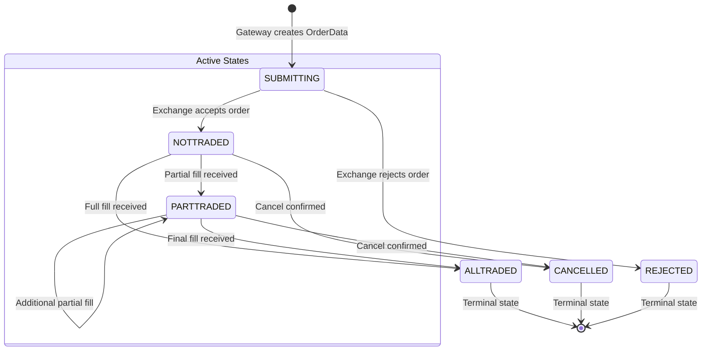
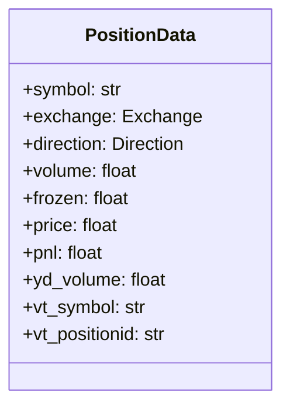
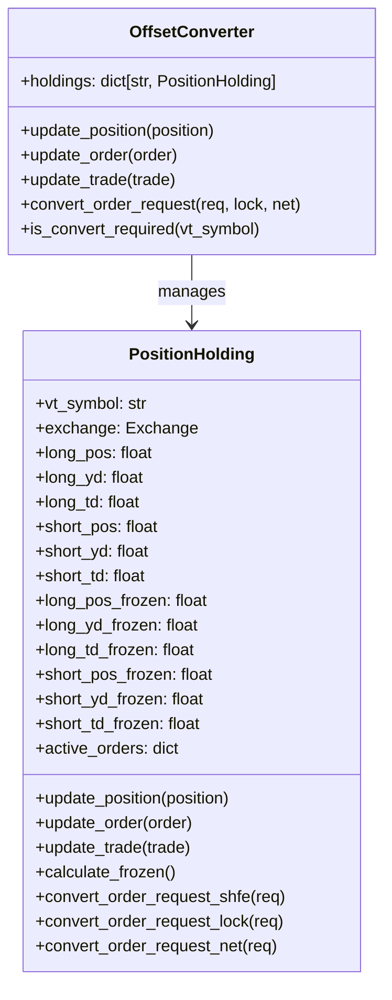
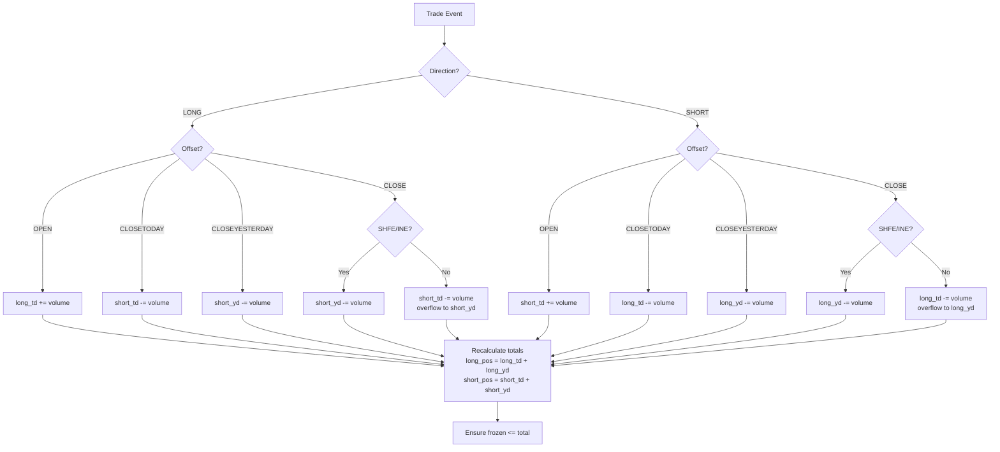
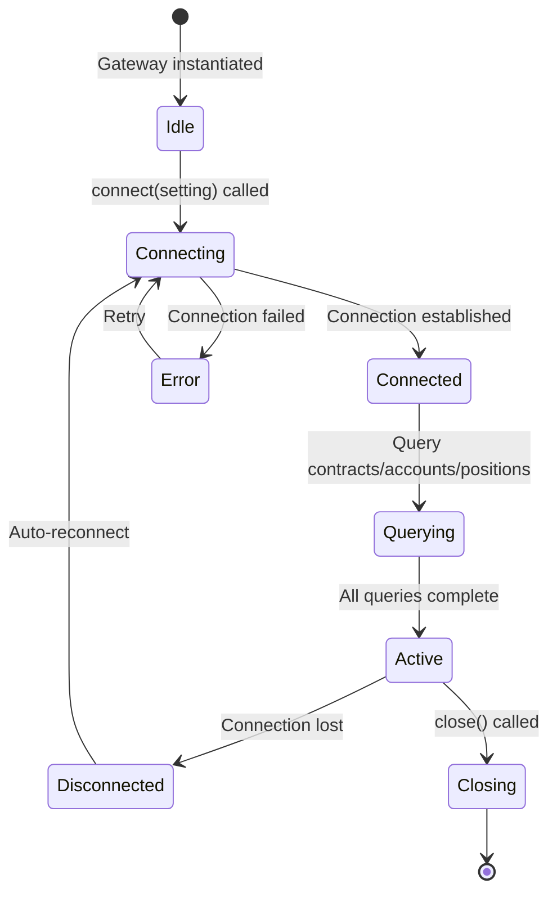
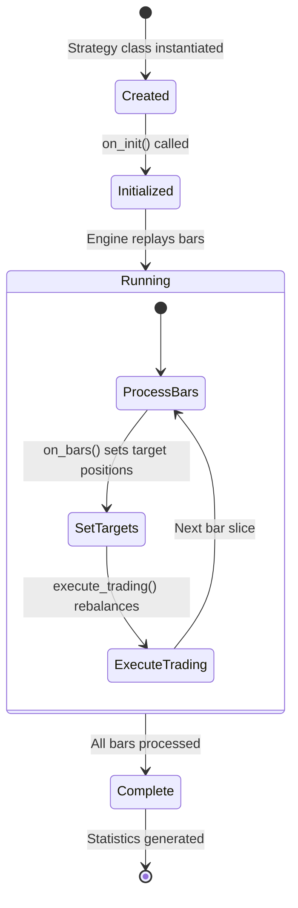
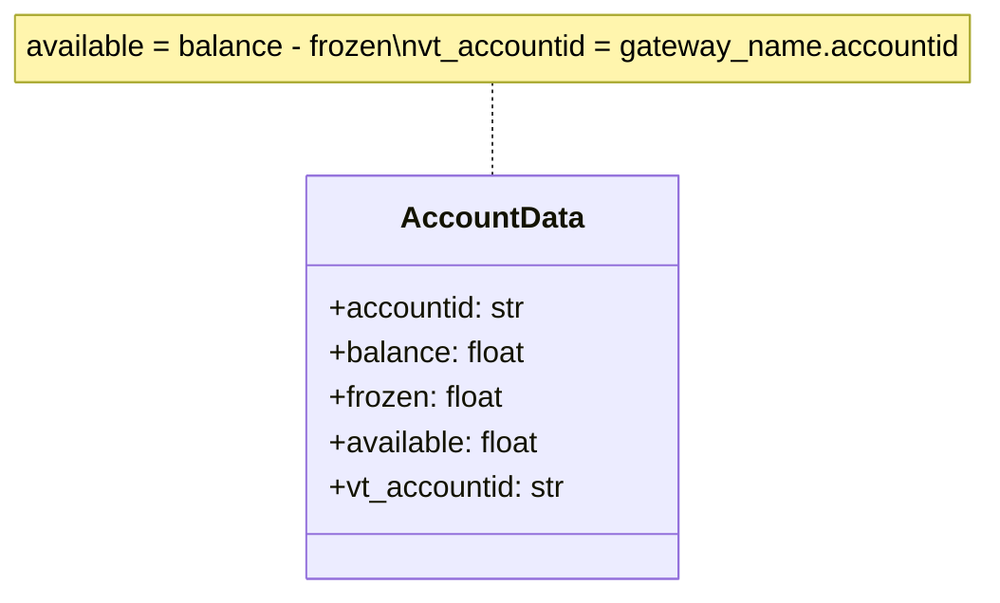
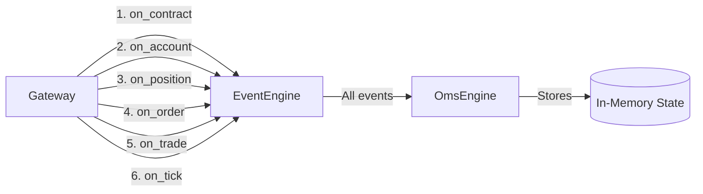

# State Management

## Order State Machine

Orders in VeighNa follow a well-defined state machine. The `Status` enum in [`src/vnpy/trader/constant.py`](../src/vnpy/trader/constant.py) defines the possible states, and `ACTIVE_STATUSES` in [`src/vnpy/trader/object.py`](../src/vnpy/trader/object.py) determines which orders are considered active.



**Active statuses**: `SUBMITTING`, `NOTTRADED`, `PARTTRADED` -- these are tracked in `OmsEngine.active_orders`.

**Terminal statuses**: `ALLTRADED`, `CANCELLED`, `REJECTED` -- when an order reaches these states, it is removed from `active_orders` but retained in the `orders` dictionary.

**Status enum values** (Chinese locale):
| Status | Chinese | Meaning |
|--------|---------|---------|
| `SUBMITTING` | "提交中" | Order submitted, awaiting exchange acknowledgment |
| `NOTTRADED` | "未成交" | Accepted by exchange, no fills yet |
| `PARTTRADED` | "部分成交" | Partially filled |
| `ALLTRADED` | "全部成交" | Fully filled |
| `CANCELLED` | "已撤销" | Cancelled (may have partial fills) |
| `REJECTED` | "拒单" | Rejected by exchange |

**OmsEngine order tracking logic** (from `process_order_event`):
```
if order.is_active():
    active_orders[vt_orderid] = order    # Track active order
elif vt_orderid in active_orders:
    active_orders.pop(vt_orderid)        # Remove completed/cancelled order
```

## Quote State Machine

Quotes (two-sided orders for market making) follow the same state machine as orders, using the same `Status` enum and `ACTIVE_STATUSES` set. The `QuoteData.is_active()` method checks the same conditions.

## Position Tracking

Position state is managed at two levels: the `OmsEngine` level and the `OffsetConverter` level.

### OmsEngine Position Tracking

The `OmsEngine` maintains a flat dictionary of positions keyed by `vt_positionid`:

```
vt_positionid = "{gateway_name}.{symbol}.{exchange}.{direction}"
```

Each `PositionData` contains:

| Field | Type | Description |
|-------|------|-------------|
| `symbol` | str | Instrument symbol |
| `exchange` | Exchange | Exchange enum |
| `direction` | Direction | LONG, SHORT, or NET |
| `volume` | float | Total position volume |
| `frozen` | float | Frozen (locked) volume |
| `price` | float | Average entry price |
| `pnl` | float | Unrealized profit/loss |
| `yd_volume` | float | Yesterday's position volume |



### OffsetConverter Position Tracking

The `OffsetConverter` ([`src/vnpy/trader/converter.py`](../src/vnpy/trader/converter.py)) maintains detailed position state via `PositionHolding` objects for exchanges that require today/yesterday distinction (SHFE, INE).



**Position update flow**:



**Frozen volume calculation**: Active orders that close positions contribute to frozen volume. The system tracks `{side}_{period}_frozen` (e.g., `long_td_frozen`) to prevent over-closing.

## Gateway Connection State

Gateway connection state is implicit -- determined by whether the gateway has successfully connected to the exchange. The `BaseGateway` does not have a formal connection state enum; instead:

- **Connected**: The gateway has established its connection and begins pushing `on_contract`, `on_account`, `on_position`, and market data events
- **Disconnected**: The gateway should attempt automatic reconnection
- **Error**: Communicated via `write_log()` which pushes `EVENT_LOG` events



**On successful connection**, gateways must:
1. Query and push `ContractData` via `on_contract()`
2. Query and push `AccountData` via `on_account()`
3. Query and push `PositionData` via `on_position()`
4. Query and push `OrderData` via `on_order()` (for existing open orders)
5. Query and push `TradeData` via `on_trade()` (for recent trades)

## Strategy State (Alpha Strategy)

Alpha strategies have a simpler lifecycle managed by the `BacktestingEngine`:



**Strategy position state** is tracked in two dictionaries:
- `pos_data: dict[str, float]` -- Actual current positions (updated on `update_trade`)
- `target_data: dict[str, float]` -- Desired target positions (set by strategy logic)

The `execute_trading()` method computes the diff between target and actual, then sends buy/sell/short/cover orders accordingly.

## Account/Balance Management

Account state is straightforward:



- **balance** -- Total account equity
- **frozen** -- Margin/collateral locked by open positions and pending orders
- **available** -- Computed as `balance - frozen`, representing funds available for new orders

The `OmsEngine` caches the latest `AccountData` per `vt_accountid`. Gateways push updated account data periodically or on change.

## Event-Driven State Consistency

All state updates flow through the `EventEngine`, ensuring a consistent update order:



The single-threaded event processing loop in `EventEngine._run()` guarantees that state updates are processed sequentially, preventing race conditions between order updates, trade fills, and position changes.

## Global Settings State

Platform configuration is managed through the `SETTINGS` dictionary in [`src/vnpy/trader/setting.py`](../src/vnpy/trader/setting.py):

| Setting | Default | Description |
|---------|---------|-------------|
| `font.family` | "微软雅黑" | UI font family |
| `font.size` | 12 | UI font size |
| `log.active` | True | Enable logging |
| `log.level` | INFO | Log level |
| `log.console` | True | Log to console |
| `log.file` | True | Log to file |
| `email.*` | (various) | SMTP email configuration |
| `datafeed.name` | "" | Datafeed module name |
| `database.timezone` | (local) | Database timezone |
| `database.name` | "sqlite" | Database module name |
| `database.*` | (various) | Database connection parameters |

Settings are loaded from `vt_setting.json` in the `.vntrader` directory (under CWD or home directory). Note: `.vntrader/` is a runtime directory created by VeighNa outside the repository; it is not checked into source control.

---
## See Also
- [README](README.md) — Project overview and quick start
- [Architecture](architecture.md) — System design and components
- [Workflow](workflow.md) — Event flows and processing pipelines
- [Development](development.md) — Development guide and best practices
