# Workflows

## Event-Driven Architecture Flow

All communication in VeighNa flows through the `EventEngine`. Components produce events by calling `EventEngine.put(event)`, and the engine distributes them to registered handlers.

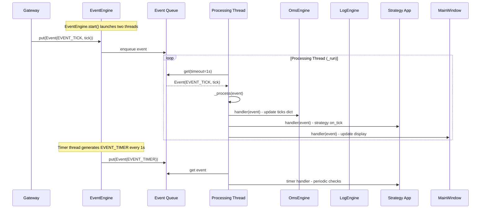

### Handler Registration and Dispatch

The `EventEngine` supports two types of handlers:

1. **Type-specific handlers** -- Registered via `register(type, handler)`, called only for matching event types
2. **General handlers** -- Registered via `register_general(handler)`, called for every event

Dispatch order: type-specific handlers first, then general handlers.

**OmsEngine handler registration** (from `register_event()`):
```
EVENT_TICK     -> process_tick_event     -> updates self.ticks[vt_symbol]
EVENT_ORDER    -> process_order_event    -> updates self.orders, self.active_orders, offset_converter
EVENT_TRADE    -> process_trade_event    -> updates self.trades, offset_converter
EVENT_POSITION -> process_position_event -> updates self.positions, offset_converter
EVENT_ACCOUNT  -> process_account_event  -> updates self.accounts
EVENT_CONTRACT -> process_contract_event -> updates self.contracts, initializes offset_converter
EVENT_QUOTE    -> process_quote_event    -> updates self.quotes, self.active_quotes
```

## Order Submission Flow

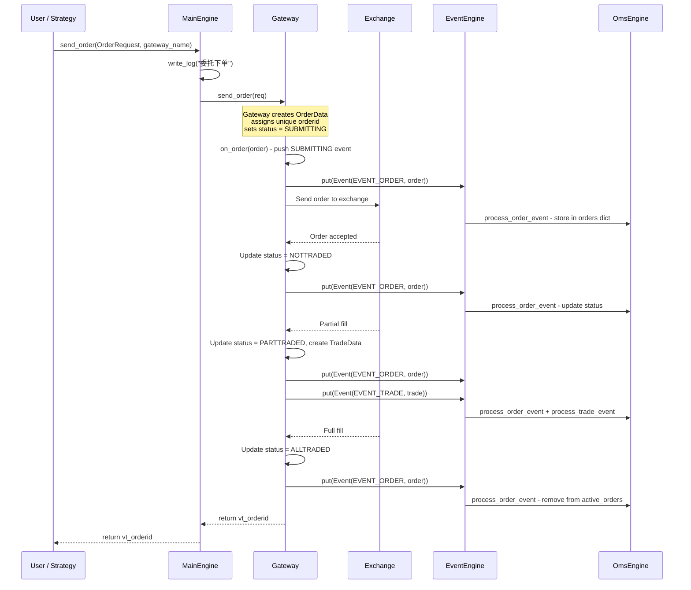

## Order Cancellation Flow

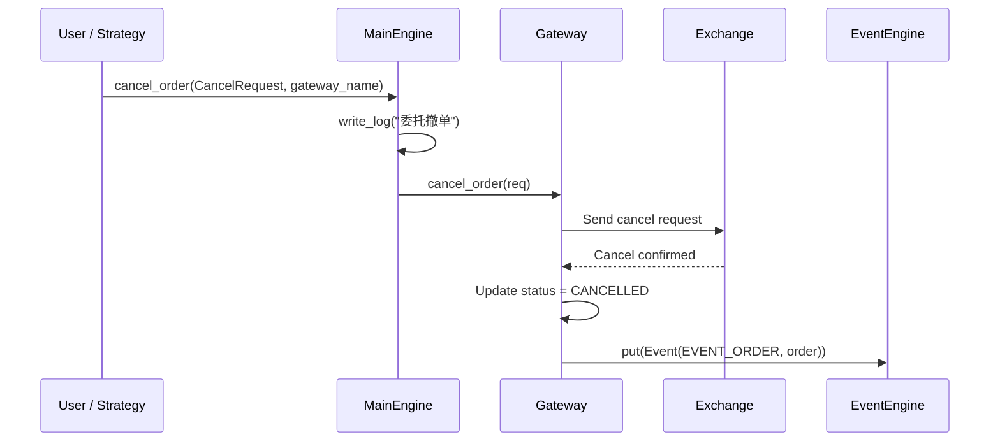

## Market Data Subscription Flow

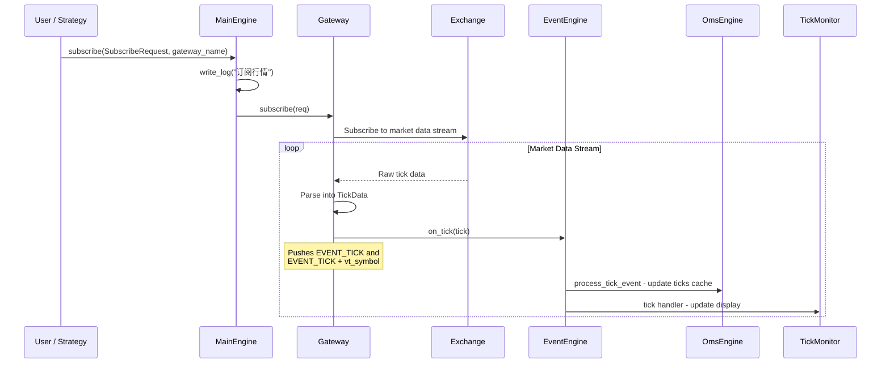

## CTA Strategy Lifecycle

A CTA (Commodity Trading Advisor) strategy operates on a single instrument with the following lifecycle:

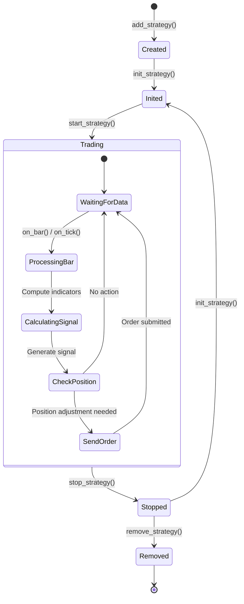

**CTA strategy signal-to-order flow**:
1. Strategy receives tick/bar data via callback
2. Strategy computes technical indicators (using TA-Lib, NumPy)
3. Strategy generates trading signal (buy/sell/short/cover)
4. Strategy calls `buy()`, `sell()`, `short()`, or `cover()` on the strategy engine
5. Strategy engine handles offset conversion (open/close/close_today/close_yesterday)
6. Order is sent through `MainEngine.send_order()` to the gateway
7. Gateway pushes order/trade events back through `EventEngine`
8. Strategy receives `on_order()` and `on_trade()` callbacks

## Alpha Strategy Workflow

The alpha strategy framework operates on multi-asset portfolios:

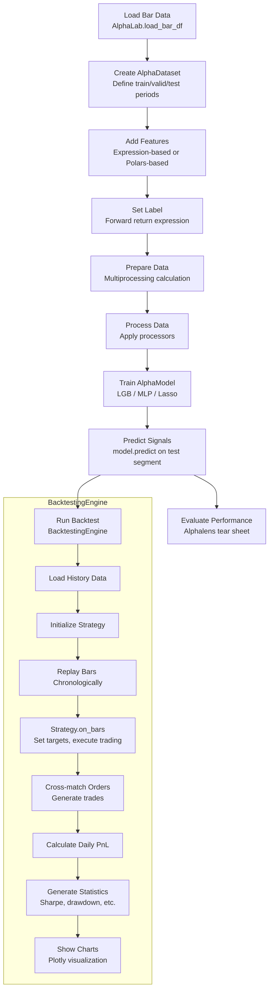

## Spread Trading Workflow

Spread trading involves constructing synthetic instruments from multiple legs:

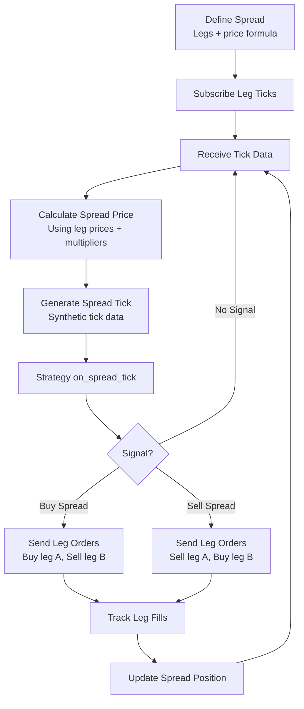

## Portfolio Management Workflow

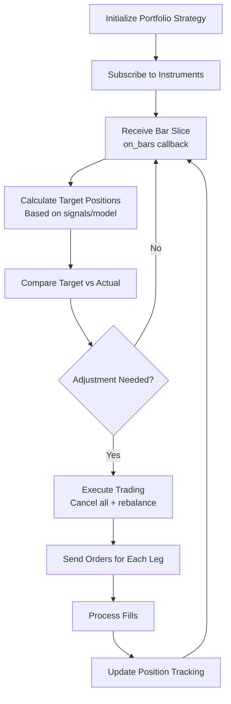

## Backtesting Flow

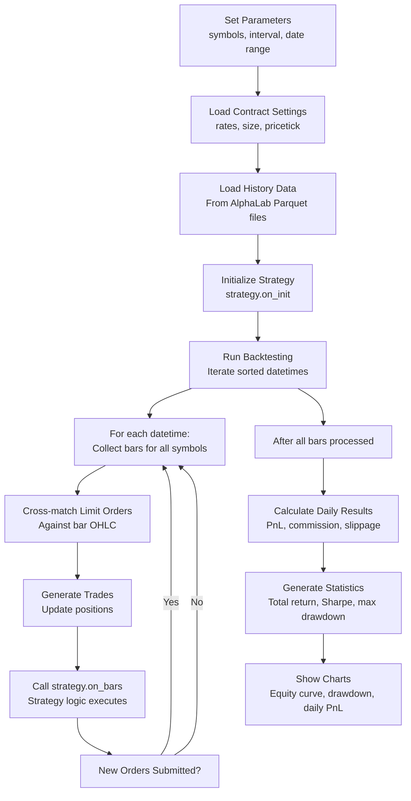

## Offset Conversion Flow

For Chinese futures exchanges (SHFE/INE), closing positions requires specifying whether to close today's or yesterday's positions. The `OffsetConverter` handles this automatically.

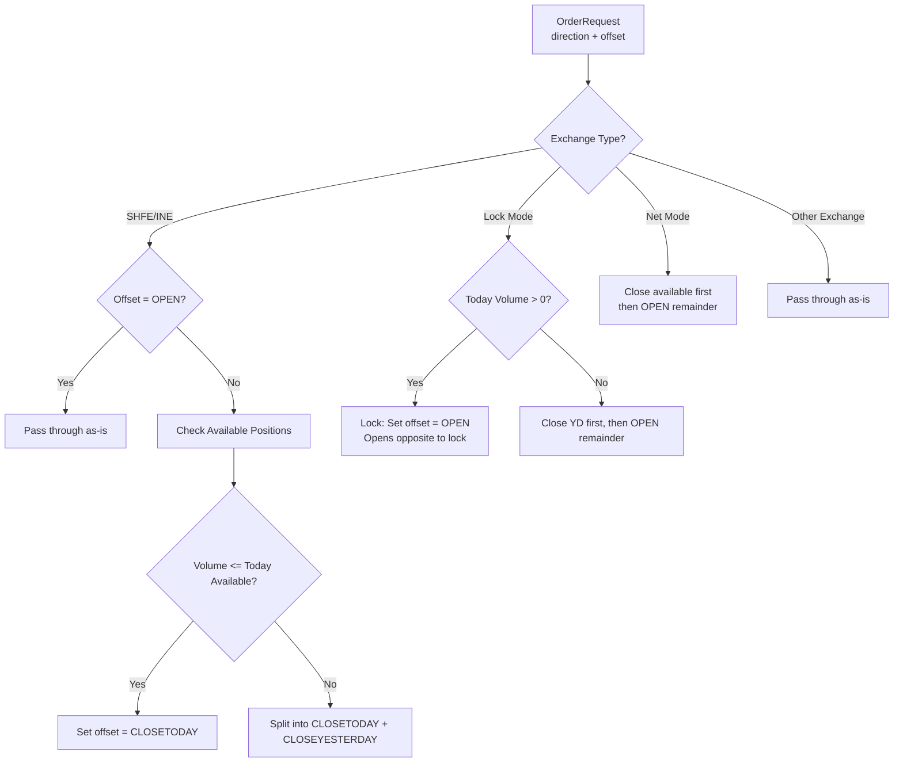

## RPC Distributed Deployment

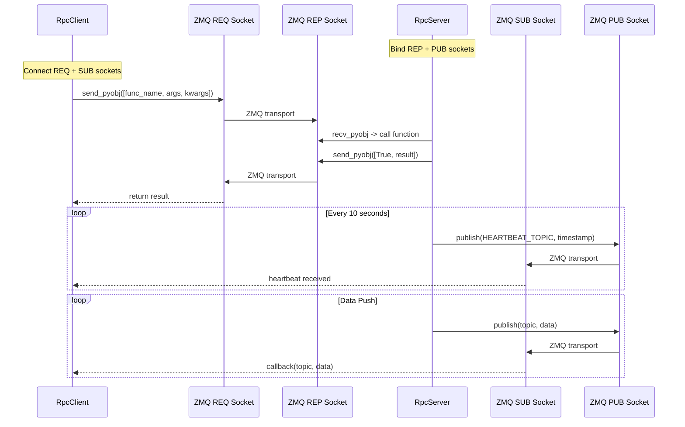

---
## See Also
- [README](README.md) — Project overview and quick start
- [Architecture](architecture.md) — System design and components
- [State Management](state-management.md) — State lifecycle and data models
- [Development](development.md) — Development guide and best practices
